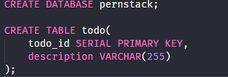

<div align="center">
  <h1>PERNSTACK TODO-LIST</h1>
  <h3>Todo list simples usando a pernstack</h3>
</div>

<p align="center">
  
</p>

<p align="center">
  Meu primeiro projeto usando Express com um banco relacional para diferenciar da maioria dos projetos com Node que usam bancos NoSQL.
</p>

<h2 align="center">
  Screenshots do app funcionando:
</h2>

<h3 align="center"> Página inicial </h3>

<p align="center">
    
</p>

<h3 align="center"> Pop-up de edição </h3>

<p align="center">
    
</p>

<hr>

## Como rodar no seu computador: 

- Configurar o Postgres:
  - No psql shell, rode os comandos que estão em ```/server/src/database.sql``` para criar o banco de dados e a tabela.

   

- Configurando o Servidor:
  - Rode ``` npm/yarn install ``` na pasta server.
  - Em ``` src/db.js ``` configure as opções para poder acessar o seu banco.
  - Por fim, rode ``` npm/yarn dev ``` ( Obs: Por padrão o servidor inicia na porta 4000. Pode ser trocado na linha 87 em ``` server/src/index.js ```).

- Configurando o FrontEnd:
    - Rode ``` npm/yarn install ``` na pasta web. 
    - Eu usei o create-react-app, para iniciar a aplicação web rode ```npm/yarn dev ``` que iniciará automaticamente na porta 3000.